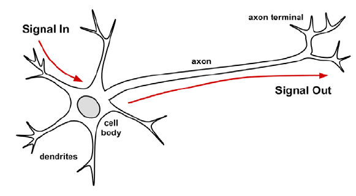
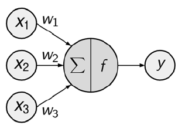
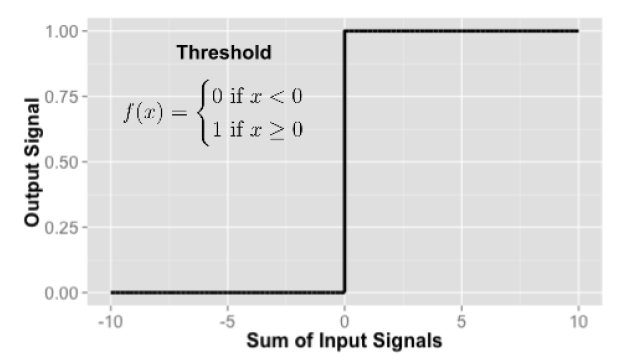
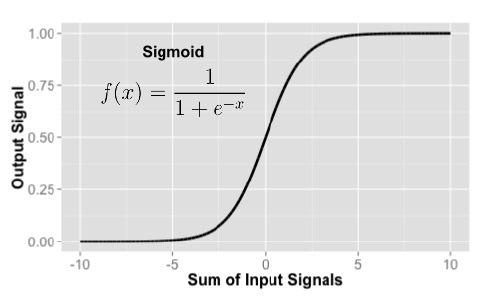

# Métodos de Clasificación

Son los métodos mas populares dentro de la minería de datos y **machine learning**. Esto principalmente por su aplicabilidad/adaptabilidad y gran variedad de técnicas.

Se encuentra dentro de la *analítica predictiva*, es decir busca predecir un comportamiento futuro, los tipos de dataset que se pueden usar pueden ser *estructurados* como *no estructurados*.

Algunos ejemplos de aplicación:

-   En una aplicación en la ciencias sociales, se pueden tener criterios de clasificación que hacen que un hogar sea "pobre"
-   En el campo de la salud; a partir de un diagnóstico se puede clasificar (predecir) una patología:
    -   Dada los síntomas de temperatura, enfermedades crónicas y comportamiento social el modelo puede deducir si la persona tiene COVID y si tiene una probabilidad fuerte de ser internado y asignado a una sala de terapia intensiva.
    -   A partir de radiografías se puede determinar una potencial patología.
-   En las redes sociales; a partir de la búsqueda de algún producto en específico los motores de búsqueda sugieren otros productos similares a los usuarios.

De manera formal los métodos de clasificación buscan entender la siguiente relación:

$$y=f(x)$$ 

Donde la variable $y$ es la variable *dependiente* y es la que se busca predecir, la *predicción* se basa en un *modelo* $f$ que utiliza como insumo un set de variables *independientes* $x$

## Variable dependiente "cualitativas"

Esta variable dependiente normalmente es una *variable natural* dentro de la población de estudio, debe existir dentro del dataset. Tradicionalmente esta puede ser:

-   *Binaria (exito y fracaso):* incluyen dos opciones.
-   *Nominales:* Es una variable cualitativa y sus categorías no tienen un orden. Género de música.
-   *Ordinales:* Es una variable cualitativa y sus categorías tienen un orden. Escala de preferencias; Mala, regular, buena.

Lo mejor es tener la variable dependiente definida de forma natural, esta también puede ser sintética a partir de un método de agrupamiento.

## Variables independientes

Estas variables pueden ser de cualquier tipo; numéricas, categóricas, etc. Lo importante es poder determinar al momento de su elección su vínculo con la variable dependiente.

$$X \rightarrow Y$$

Es importante evitar *redundancia* en esta relación y una relación opuesta:

$$ X \rightarrow Y \quad  Y \rightarrow X$$

La relación opuesta se debe evitar (tiempo)

$$Y \rightarrow X$$

Se recomienda que las variables X sean estructurales. Dependiendo del uso, se recomienda dimensionar la *cantidad* de variables independientes.

## Base de datos de entrenamiento y test/prueba

Como el objetivo es clasificar a nuevas unidades, se parte de un dataset completo, es decir una que contiene a $y$ y $x$. Este dataset se lo divide de manera aleatoria en 2; un dataset de entrenamiento y un dataset de prueba, este último simula el comportamiento de unidades nuevas y permite calibrar el modelo $f$.

No existe un criterio para los tamaños de estas bases de datos, los más usuales son:

-   50%, 50%
-   Entrenamiento: 80%, Prueba: 20%
-   Entrenamiento: 70%, Prueba: 30%

Una vez realizada la partición se entrena el modelo en el dataset de entrenamiento, se definen los parámetros, se verifican supuestos y una vez que se tenga un modelo candidato, este se lo pone a prueba en el dataset de entrenamiento y se mide su rendimiento, es decir:

$$y_{original/test} \approx  y_{predecida/f}$$

## Técnicas de clasificación

-   *Regresión logística (logit)*
-   *Naive bayes (probabilísticos)*
-   *K vecinos más cercanos (KNN)*
-   *Árbol de clasificación (CART)*
-   Análisis discriminante lineal (LDA)
-   Máquinas de vectores de soporte (SVM)
-   *Redes neuronales*

## Pasos a seguir

0.  Identificar la variable que se requiere clasificar (Y), definir covariables (X) para construir el modelo. $Y$, $X$. (Definir el dataset a usar)
1.  Preparar la base de datos; base de entrenamiento (trainbd) y de testeo (testbd).
2.  Sobre la base de datos de entrenamiento, definir el modelo de clasificación 
  - Regresión logística (logit) 
  - Naive bayes 
  - K vecinos más cercanos (KNN) 
  - Árbol de clasificación (CART)
  - Red neuronal
3.  Seguir los pasos según cada modelo
4.  Verificar la calidad de la clasificación, usando la base de datos de testeo: **Matriz de confusión**

## Base de datos de entrenamiento y testeo

  -   Antes de realizar la partición asegurarse de identificar las variables Y y X del estudio, revisar valores perdidos y una buena definición del *tipo de las variables (numeric, factor)*.
  -   Se sugiere que la partición sea aleatoria
  -   Con la partición realizada, se debe verificar que son grupos estadísticamente similares.

```{r}
library(dplyr)
##################
##código R básico
N<-nrow(iris)
set.seed(1256)#semilla aleatoria
ss<-sample(c(T,F),N,replace = T, prob = c(0.7,0.3))
table(ss)/N
#indexación
bdtrain<-iris[ss, ]
bdtest<-iris[!ss, ]
#dplyr
bdtrain<-iris %>% filter(ss==T)
bdtest<-iris %>% filter(ss==F)
##################
##código R básico (exacto)
N<-nrow(iris)
set.seed(1309)
ss1<-order(runif(N))<=(N*0.7)
table(ss1)/N
#dplyr
bdtrain<-iris %>% filter(ss1==T)
bdtest<-iris %>% filter(ss1==F)
##################
##DPLYR + un ID/KEY/FOLIO
iris %>% mutate(aux=1,id=cumsum(aux))#o1
iris$id<-1:N#o2
set.seed(1348)
bdtrain<-iris %>% sample_frac(0.7)
bdtest<-iris %>% anti_join(bdtrain,by="id")
#EXPLORATORIO
bdaux<-bdtrain %>% mutate(tipo="E") %>% 
  bind_rows(bdtest %>% mutate(tipo="P"))
summary(bdtrain$Sepal.Length)
summary(bdtest$Sepal.Length)
library(ggplot2)
ggplot(bdaux,aes(Sepal.Length,col=tipo))+
  geom_density()
ggplot(bdaux,aes(Petal.Length,col=tipo))+
  geom_density()
ggplot(bdaux,aes(Sepal.Width,col=tipo))+
  geom_density()
ggplot(bdaux,aes(Petal.Width,col=tipo))+
  geom_density()
#Analítico
t.test(Sepal.Length~tipo ,data=bdaux)
t.test(Petal.Length~tipo ,data=bdaux)
t.test(Sepal.Width~tipo ,data=bdaux)
t.test(Petal.Width~tipo ,data=bdaux)
ks.test(Sepal.Length~tipo ,data=bdaux)
ks.test(Petal.Length~tipo ,data=bdaux)
ks.test(Sepal.Width~tipo ,data=bdaux)
ks.test(Petal.Width~tipo ,data=bdaux)
table(bdtrain$Species)/105
table(bdtest$Species)/45
chisq.test(table(bdaux$Species,bdaux$tipo))
```

### Actividad 1

Usando la encuesta a hogares:

-   proponga una variable Y para la clasificación
-   Proponga un set de variables X
-   Obtenga las bases de datos de entrenamiento y de testeo
-   Verifique que las bases son estadísticamente similares

## Logit/Probit

  - Se usan para realizar clasificaciones basadas en *probabilidades*
  - Las clasificaciones son del tipo *1/0*
  - Existen variaciones para clasificar considerando más grupos, empleando el logit y probit ordenado.

### Modelos de elección binaria

Sea $(Y,X)$ un vector aleatorio con $Y \in \{0,1\}$ y $X \in \mathbb{R}^p$. La probabilidad de respuesta de $Y$ con respecto a $X$ es:

$$P(x)=P(Y=1|X=x)=E[Y|X=x]$$

Donde el *efecto marginal* queda como:

$$\frac{\partial}{\partial x} P(x)=\frac{\partial}{\partial x}P(Y=1|X=x)=\frac{\partial}{\partial x}E[Y|X=x]$$

  + Probit
  
$$P(x)=\Phi(x'\beta)$$

Donde $\Phi$ corresponde a la función de distribución de una va normal.
  
  + Logit
  
$$P(x)=\Lambda(x'\beta) \quad \Lambda(\mu)=(1+exp(-u))^{-1}$$

### Pasos

  0.  Identificar la variable (1/0) que se requiere clasificar, definir covariables para construir el modelo
  1.  Especificar el modelo (logit/probit)
  2.  Identificar las variables significativas
  3.  Construir el modelo con variables significativas (evitar colinealidad alta)
  4.  Predecir la clase de pertenencia en la base de test ($prob>0.5$)
  5.  Observar la clasificación dada con base a la probabilidad fijada (opcional)
  6.  Comparar lo observado y lo predicho (testbd)(opcional)
  7.  Generar la matriz de confusión (librería caret)
  8.  Efectos marginales (opcional)

```{r}
rm(list=ls())
library(dplyr)
library(caret)
#0. Identificar la variable (1/0) que se requiere clasificar, definir covariables para construir el modelos
clase<-unique(iris$Species)
iris<-iris %>% mutate(y = Species==clase[2]) 
#crear la base de datos de entrenamiento y test (70/30). Omitir la variable Species (5 min)

iris$id<-1:nrow(iris)
set.seed(805)
bdtrain<-iris %>% sample_frac(0.7) 
bdtest<-iris %>% anti_join(bdtrain,by="id") 
bdtrain<- bdtrain %>% select(-id, -Species)
bdtest<- bdtest %>% select(-id, -Species)
#nota: se debe verificar el balance de las bases.

#1. Especificar el modelo (logit/probit)
m1<-glm(y ~ . , data=bdtrain, family = binomial(link="logit"))
m2<-glm(y ~ . , data=bdtrain, family = binomial(link="probit"))

#2. Identificar las variables significativas
step(m1)
step(m2)

#3. Construir el modelo con variables significativas
m3<-step(m1)
m4<-step(m2)

#4. Predecir la clase de pertenencia en la base de test ($prob>0.5$)

prob_l<-predict(m3, bdtest, type="response")
prob_p<-predict(m4, bdtest, type="response")

#5. Observar la clasificación dada con base a la probabilidad fijada

prob_l >0.5
prob_p >0.5

#6. Comparar lo observado y lo predicho (bdtest)

bdtest<-bdtest %>% mutate(yl=(prob_l >0.5),
                  yp=(prob_p >0.5))

tl<-table(bdtest$y, bdtest$yl)
tp<-table(bdtest$y, bdtest$yp)

#7. Generar la matriz de confusión (librería caret)

confusionMatrix(tl)
confusionMatrix(tp)
```

## Naive Bayes

Es un modelo basado en probabilidad, su base teórica aplica el teorema de Bayes (fuerte supuesto de independencia).

$$P(Y/X)=\frac{P(Y)*P(X/Y)}{P(X)} \approx P(Y)*P(X/Y)$$

  * $P(Y/X)$ Probabilidad Posterior 
  * $P(Y)$ Probabilidad a Priori
  * $P(X/Y)$ Verosimilitud
  * $P(X)$ Marginal

Si se tiene varios predictores ($X$) se supone independencia, esto es:

$$P(Y/X) =  \frac{P(X_1/Y)*P(X_2/Y)*\ldots *P(X_p/Y)*P(Y)}{P(X)}$$

Pasos, 

  0. Identificar la variable de grupo y las covariables y construir la base de datos de entrenamiento y test.
  
  - iris: Y=Especie, X=Vector de características

```{r}
library(dplyr)
data(iris)
iris$id<-1:nrow(iris)
set.seed(1107)
bdtrain<-iris %>% sample_frac(0.7) 
bdtest<-iris %>% anti_join(bdtrain,by="id") 
bdtrain<- bdtrain %>% select(-id)
bdtest<- bdtest %>% select(-id)
```

  1. Cargar la librería *e1071* y *naivebayes* emplear la función naiveBayes para construir el clasificador
  
```{r}
library(e1071)
library(naivebayes)
#naiveBayes(Y~.,data=)
#naive_bayes(Y~.,data=)
m1<-naiveBayes(Species ~ . , data=bdtrain )
m2<-naive_bayes(Species ~ . , data=bdtrain)
```

  2. Explorar los resultados
  
```{r}
m1
summary(m1)
m2
summary(m2)
plot(m2)
```

  3. Predecir los resultados en la base de testeo
  
```{r}
c1<-predict(m1, bdtest, "class")
c2<-predict(m2, bdtest, "class")
table(c1,c2)
bdtest$c1<-c1
bdtest$c2<-c2
View(bdtest)
```

  4. Realizar la matriz de confusión

```{r}
library(caret)
t1<-table(bdtest$Species, bdtest$c1)
confusionMatrix(t1)
```

## k-nearest neighbors - KNN (Vecino más cercano)

Esta basado en las distancias más cercanas

Fortalezas

  - Sencillo y efectivo
  - Fase de entrenamiento rápido
  - No hace suposiciones sobre la distribución de datos subyacente

Debilidades

  - No produce un modelo
  - Fase de clasificación lenta
  - Requiere una gran cantidad de memoria
  
Basado en distancias, principalmente la euclideana (cuantitativas, binarias).

$$d(x,y)=\sqrt{\sum (x_i-y_i)^2}$$

  - K representa el número de vecinos cercanos
  - La clase se clasifica según la proporción de clase más alta de los k vecinos más cercanos
  - Se recomienda escalar las covariables a una misma unidad de medida, si existen múltiples unidades de medida.
  
$$k=||\sqrt{n_{train}}||$$

```{r}
rm(list=ls())
library(class)
library(dplyr)
library(caret)
bd<-iris
#bases de entrenamiento y test
set.seed(1322)
aux<-sample(c(1,2),nrow(bd),replace = T,prob = c(0.7,0.3))
bdtrain<-bd %>% filter(aux==1)
bdtest<-bd %>% filter(aux==2)

#preparando las bases de datos
#cl
clase_train<-bdtrain$Species
#train
bdtrain<-bdtrain %>% select(-Species)
#cl
clase_test<-bdtest$Species
#test
bdtest<-bdtest %>% select(-Species)

# algoritmo
class(clase_train)
k<-round(sqrt(nrow(bdtrain)),0)
knn(bdtrain,bdtest,clase_train,k,prob = F)
pred_clase<-knn(bdtrain,bdtest,clase_train,k)
t1<-table(clase_test, pred_clase)
confusionMatrix(t1)
#######Normalizando
bdtrain_n<-scale(bdtrain)
bdtest_n<-scale(bdtest)

pred_clase<-knn(bdtrain_n,bdtest_n,clase_train,k)
t2<-table(clase_test,pred_clase)
confusionMatrix(t2)
```
  
## Árboles de decisión y CART (Classification and regression Tree - CART)

### Árboles de decisión

  + A finales de la década de 1970, Ross Quinlan estaba desarrollando modelos basados en árboles como ID3.
  + En la década de 1980, estos métodos evolucionaron hasta convertirse en un modelo de árbol de clasificación llamado C4.5 (Quinlan, 1993).
  + Aunque Quinlan publicó muy poco sobre este modelo después de su libro, estuvo evolucionando continuamente el árbol de clasificación y los modelos basados en reglas hasta la última encarnación llamada C5.0.
  + C5.0 era propietario y estaba disponible comercialmente hasta 2011, cuando se lanzó una versión GPL.
  + Kuhn y Johnson (2013) tienen una descripción más completa de C5.0 (y otro modelo inédito llamado Cubista).

C5.0 utiliza la entropía para guiar la construcción del árbol de decisión. En cada paso, el algoritmo selecciona el atributo que produce la mayor reducción en la entropía general de los datos. Esto ayuda a garantizar que el árbol de decisión se concentre en los atributos que son más importantes para clasificar los datos correctamente.

$$Entropia(X)=-\sum_c p(x) *log_2(p(x))$$

  + 0 No hay incertidumbre
  + 1 Incertidumbre total

```{r}
library(dplyr)
px<-prop.table(table(iris$Species))
(-1)*sum(px*log2(px))
aux<-iris%>% filter(Sepal.Length>5.7)
px1<-prop.table(table(aux$Species))
(-1)*sum(px1*log2(px1))
```

```{r}
rm(list=ls())
library(dplyr)
library(C50)# árbol de decisión
library(rpart) # cart
library(rpart.plot)# figura cart
library(caret) # matrix conf
#######################################
bd<-iris
#bases de entrenamiento y test
set.seed(1246)
aux<-createDataPartition(bd$Species, p=0.7,list=F)
bdtrain<-bd[aux,]
bdtest<-bd[-aux,]
#preparando las bases de datos
m1<-C5.0(Species~. ,data=bdtrain)
m1
summary(m1)
plot(m1)

m2<-C5.0(Species~.,data=bdtrain, trials=10)
m2
summary(m2)
plot(m2)

## calidad del modelo
clase_pre<-predict(m1, bdtest)

t1<-table(bdtest$Species,clase_pre)
confusionMatrix(t1)

control <- trainControl(method = "cv", number = 5)
modelo_cv <- train(Species~., data = bdtrain,
                   method = "C5.0",
                   trControl = control,
                   tuneGrid = expand.grid(trials = 1:10,
                                          model = "tree",
                                          winnow = FALSE))

# Ver resultados
print(modelo_cv)
plot(modelo_cv)
```

### CART

+ Standar Deviation Reduction (Regresión)

$$SDR=\sigma_T-\sum_c\frac{T_i}{T}*\sigma_{T_i}$$
+ Entropía (clasificación)

$$
\text{Entropía}(t) = - \sum_{i=1}^{k} p_i \log_2(p_i)
$$
+ Gini (clasificación)

$$
\text{Gini}(t) = 1 - \sum_{i=1}^{k} p_i^2
$$

```{r}
set.seed(1307)
m3<-rpart(Species~ . , data=bdtrain)
rpart.plot(m3)

clase_cart<-predict(m3, bdtest, type = "class")

t2<-table(bdtest$Species,clase_cart)
confusionMatrix(t2)
summary(m3)
#prune.rpart# podado
```

## Introducción a redes neuronales

(Ver google trends)

ANN (Artificial *Neural* Network) es conocido como un método **Black Box**.

  - *El cerebro humano* está compuesto por alrededor de *85 mil millones* de neuronas
  - Una red capaz de almacenar una enorme cantidad de conocimiento
  - Un *gato* tiene aproximadamente *mil millones de neuronas*
  - Un *ratón* tiene alrededor de *75 millones de neuronas* 
  - Una *cucaracha* tiene solo alrededor de un *millón de neuronas*.



Muchas ANN contienen muchas menos neuronas, generalmente solo *varios cientos*.

  - Un cerebro de mosca de la fruta con 100,000 neuronas supera el estado actual de ANN.
  
Una *ANN* *modela la relación* entre un conjunto de *señales de entrada* y una *señal de salida* utilizando un modelo derivado de nuestra comprensión de cómo un cerebro biológico responde a los estímulos de las entradas sensoriales. Así como un cerebro usa una red de células interconectadas llamadas neuronas para crear un procesador paralelo masivo, la *ANN* usa una red de *neuronas artificiales* o *nodos* para resolver problemas de aprendizaje.  

### Topología de una red  

  + El número de capas (layers)
  + Si se permite que la información en la red viaje hacia atrás
  + El número de nodos dentro de cada capa de la red

La *topología* determina la *complejidad* de las tareas que la red puede aprender. Generalmente, las redes más grandes y complejas son capaces de identificar patrones más sutiles y límites de decisión complejos. Sin embargo, la potencia de una red no solo depende del tamaño de la red, sino también de la forma en que se organizan las unidades.

La red neuronal se construye con un grupo de *nodos interconectados*, que involucra la entrada, los *pesos* conectados, el elemento de procesamiento y la salida. Las redes neuronales se pueden aplicar a muchas áreas (entrada, salida), como la *clasificación*, el *agrupamiento* y la *predicción*. 



  + Dendritas: $X$ (input)
  + Axon terminal: $Y$ (output)
  + Señal de la dendrita: $w_i$ (peso)
  + Función de activación: $f$
  
$$y(x)=f\left(\sum_{i=1}^n w_i*x_i \right)$$
  
Características de una red:
  
  + Función de activación: $f$
  + Topología de la red: Arquitectura
  + Algoritmo de entrenamiento: Como se establecen los pesos
  
### Funciones de activación

La función de activación es el *mecanismo* por el cual la *neurona artificial* *procesa la información* y la pasa *a través de la red*. Así como la neurona artificial está modelada según la versión biológica, también la función de activación está modelada según el diseño de la naturaleza.

En el caso *biológico*, la función de activación podría imaginarse como un proceso que consiste en sumar la señal de entrada total y determinar si alcanza el umbral de *disparo*. Si es así, la neurona transmite la señal; de lo contrario, no hace nada. En términos de ANN, esto se conoce como *función de activación de umbral*, ya que da como resultado una señal de salida solo una vez que se ha alcanzado un umbral de entrada específico.

En la naturaleza esta función sería:



Aunque la función de activación del umbral es interesante debido a sus paralelismos con la biología, rara vez se usa en redes neuronales artificiales. Liberadas de las limitaciones de la bioquímica, las funciones de activación de ANN se pueden elegir en función de su capacidad para demostrar características matemáticas deseables y modelar relaciones entre datos.




### Redes neuronales para la clasificación

La red neuronal es una red formada por neuronas artificiales (o nodos). Hay tres tipos de neuronas dentro de la red: neuronas de *entrada* ($X$), neuronas *ocultas* (variable latentes) y neuronas de *salida* ($Y$). En la red, las neuronas están conectadas; la fuerza de conexión entre las neuronas se llama pesos ($w$). Las neuronas de entrada reciben la información de entrada; cuanto mayor sea el valor de entrada, mayor será la activación.

Las ventajas de una red neuronal son: primero, puede detectar relaciones **no lineales** entre la variable dependiente e independiente. En segundo lugar, uno puede entrenar de manera *eficiente* *grandes conjuntos de datos* utilizando la arquitectura *paralela*. Tercero, es un modelo *no paramétrico* por lo que se pueden eliminar errores en la estimación de parámetros. 

Las principales desventajas de una red neuronal son que a menudo converge al mínimo local en lugar del mínimo global. Además, puede sobreajustarse cuando el proceso de entrenamiento dura demasiado.

Para la clasificación es importante tener presente de manera previa al modelo:

  + Las unidades de medida afectan las funciones de activación, para evitar esto se recomienda estandarizar las variables.
    - Ej: Ingreso laboral (Bs.), años de educación (años)
  + En general, el número de nodos ocultos no cuenta con una regla respecto su valor, solo se recomienda no tener demasiados nodos ocultos, ya que esto genera un sobre ajuste. Como recomendación general, se puede tener una cantidad máxima equivalente al número de covariables (X).

En el caso del R existen dos librerías: 

  + neuralnet: Permite tener una aproximación visual.
  + nnet: Más eficiente en tiempo, "resultado" 

```{r, eval=F}
rm(list = ls())
library(neuralnet)
bd<-iris
##########
#grupos
unique(bd$Species)
bd$setosa<-bd$Species=="setosa"
bd$versicolor<-bd$Species=="versicolor"
bd$virginica<-bd$Species=="virginica"
##########
set.seed(1329)
aux<-sample(c(1,2),nrow(bd),replace = T, prob = c(0.7,0.3))
bdtrain<-bd[aux==1,]
bdtest<-bd[aux==2,]
#modelo
m1<-neuralnet(setosa+versicolor+virginica~Sepal.Length+Sepal.Width+Petal.Length+Petal.Width, data = bdtrain, hidden = 1)

m2<-neuralnet(setosa+versicolor+virginica~Sepal.Length+Sepal.Width+Petal.Length+Petal.Width,data = bdtrain,hidden = 2)

m3<-neuralnet(setosa+versicolor+virginica~Sepal.Length+Sepal.Width+Petal.Length+Petal.Width,data = bdtrain,hidden = 3)
m4<-neuralnet(setosa+versicolor+virginica~Sepal.Length+Sepal.Width+Petal.Length+Petal.Width,data = bdtrain,hidden = 4)

summary(m1)
plot(m1)
plot(m2)
plot(m3)
plot(m4)

gwplot(m3, selected.response = 2, selected.covariate = 3)

rr<-compute(m3,bdtest)

aux<-c("setosa","versicolor","virginica")[apply(rr$net.result,1,which.max)]

library(caret)
t1<-table(bdtest$Species,aux)
t1
confusionMatrix(t1)
#######################
rm(list = ls())
library(nnet)
library(caret)
bd<-iris
aux<-sample(c(1,2),nrow(bd),replace = T, prob = c(0.7,0.3))
bdtrain<-bd[aux==1,]
bdtest<-bd[aux==2,]

m5<-nnet(Species~.,data=bdtrain,size=3)
summary(m5)
m5p<-predict(m5,bdtest,type = "class")
m5p
t1<-table(m5p,bdtest$Species)
confusionMatrix(t1)
```

## Ejemplo del funcionamiento de una red neuronal

- Dataset con 2 covariables y una y (binaria)
- La capa oculta tiene 2 neuronas
- 1 salida con activación sigmoide
- Pesos aleatorios
- 2 iteraciones usando el algoritmo backpropagation con descenso del gradiente

$$\sigma(z)=\frac{1}{1+e^{-z}}$$
Capa oculta

$$
\begin{aligned}
  z_{h1} &= w_{11}x_1 + w_{12}x_2 + b_1 \\
  a_{h1} &= \sigma(z_{h1}) \\
  z_{h2} &= w_{21}x_1 + w_{22}x_2 + b_2 \\
  a_{h2} &= \sigma(z_{h2})
\end{aligned}
$$

Capa de salida:

$$
\begin{aligned}
  z_o &= w_{o1}a_{h1} + w_{o2}a_{h2} + b_o \\
  \hat{y} &= \sigma(z_o)
\end{aligned}
$$
SGD es un método de optimización para minimizar la función de error actualizando los pesos con **una sola observación a la vez**.

$$
\theta^{(t+1)} = \theta^{(t)} - \eta \cdot \nabla_\theta \, \mathcal{L}^{(i)}(\theta)
$$

Donde:
- $\theta$: peso o parámetro a ajustar
- $\eta$: tasa de aprendizaje
- $\mathcal{L}^{(i)}$: función de pérdida para la i-ésima observación
- $\nabla_\theta \mathcal{L}^{(i)}$: gradiente (derivada) del error con respecto a ese peso

$$
\begin{aligned}
  \delta_o &= (\hat{y} - y) \cdot \sigma'(z_o) \\
  \delta_{h1} &= \delta_o \cdot w_{o1} \cdot \sigma'(z_{h1}) \\
  \delta_{h2} &= \delta_o \cdot w_{o2} \cdot \sigma'(z_{h2})
\end{aligned}
$$

$$
\theta_{nueva} = \theta_{anterior} - \eta \cdot \frac{\partial E}{\partial \theta}
$$

```{r}
library(nnet)
# Dataset
x <- data.frame(
  x1 = c(0.00, 0.77),  # edad normalizada
  x2 = c(0.25, 0.67)   # presión normalizada
)
y <- c(0, 1)

#Pesos aleatorios
set.seed(123)
w <- runif(9, min = -0.5, max = 0.5)
names(w) <- c(
  "w11", "w12", "b1",     # pesos para h1
  "w21", "w22", "b2",     # pesos para h2
  "wo1", "wo2", "bo"      # pesos para salida
)
w
#Sigmoide y su derivada
sigmoid <- function(z) 1 / (1 + exp(-z))
sigmoid_deriv <- function(z) sigmoid(z) * (1 - sigmoid(z))

#iteración
iteracion_manual <- function(x1, x2, y_true, w, lr = 0.1) {
  # Propagación
  zh1 <- w["w11"] * x1 + w["w12"] * x2 + w["b1"]
  ah1 <- sigmoid(zh1)
  
  zh2 <- w["w21"] * x1 + w["w22"] * x2 + w["b2"]
  ah2 <- sigmoid(zh2)

  zo <- w["wo1"] * ah1 + w["wo2"] * ah2 + w["bo"]
  y_hat <- sigmoid(zo)

  # Errores
  delta_o <- (y_hat - y_true) * sigmoid_deriv(zo)
  delta_h1 <- delta_o * w["wo1"] * sigmoid_deriv(zh1)
  delta_h2 <- delta_o * w["wo2"] * sigmoid_deriv(zh2)

  # Actualización de pesos salida
  w["wo1"] <- w["wo1"] - lr * delta_o * ah1
  w["wo2"] <- w["wo2"] - lr * delta_o * ah2
  w["bo"]  <- w["bo"]  - lr * delta_o

  # Actualización pesos ocultos
  w["w11"] <- w["w11"] - lr * delta_h1 * x1
  w["w12"] <- w["w12"] - lr * delta_h1 * x2
  w["b1"]  <- w["b1"]  - lr * delta_h1

  w["w21"] <- w["w21"] - lr * delta_h2 * x1
  w["w22"] <- w["w22"] - lr * delta_h2 * x2
  w["b2"]  <- w["b2"]  - lr * delta_h2

  list(y_hat = y_hat, pesos = w)
}
#Primera iteración
w1 <- iteracion_manual(x[1,1], x[1,2], y[1], w)
cat("Predicción 1: ", round(w1$y_hat, 4), "\n")

w2 <- iteracion_manual(x[2,1], x[2,2], y[2], w1$pesos)
cat("Predicción 2: ", round(w2$y_hat, 4), "\n")
#Segunda iteración
w3 <- iteracion_manual(x[1,1], x[1,2], y[1], w2$pesos)
cat("Predicción 3: ", round(w3$y_hat, 4), "\n")

w4 <- iteracion_manual(x[2,1], x[2,2], y[2], w3$pesos)
cat("Predicción 4: ", round(w4$y_hat, 4), "\n")
```


## Red Neuronal VS OLS

Un modelo OLS coincide en resultados con una red neuronal cuando: no se define capa oculta, función lineal y sin entrenamiento en la capa de salida.

```{r}
#ols
m0<-lm(Murder~., data=USArrests)
summary(m0)
#nnet
m1 <- nnet(Murder  ~ . , data = USArrests, 
                    size = 0,
                    linout = TRUE,
                    skip = TRUE,
                    trace = FALSE,
                    maxit = 500)
m1$wts  # Pesos de la red
```

## Ejemplo de las técnicas de clasificación con la EH

  - Dataset: EH 23
  - Y (GRUPO): Discriminación
  - Unidad de análisis: Personas de 18 años o más
  - X (COVARIABLES): 
    + Sexo 
    + Edad
    + Años de educación
    + Condición de ocupación (condact)
    + Autoidentificación indígena
    + Ingreso laboral
    + Número de miembros
    + Cuenta con internet
    
```{r}
rm(list = ls())
library(dplyr)
library(tidyr)
library(haven)
library(labelled)
library(caret)
library(C50)
library(rpart)
library(rpart.plot)
library(naivebayes)
library(class)
library(nnet)
#############################
load("_data/eh23.RData")
bd<-eh23p %>% select(folio, nro, area,
                  sexo=s01a_02, 
                  edad=s01a_03,
                  aestudio,
                  condact,
                  indigena=s01a_09,
                  ylab,
                  totper
                  )
bd<-bd %>%left_join(
  eh23v %>% select(folio, internet=s06a_19)
)
bd<-bd %>% filter(edad>=18)
bd<-bd %>% mutate(ylab=replace_na(ylab,0))
bd<-na.omit(bd)
##############################
# 0. Variable de Clasificación
##############################
bd<-bd %>% right_join(  
  eh23d %>% mutate(y=(s09a_01f==1)) %>% select(folio, nro, y)) 
names(bd)
bd<-na.omit(bd)
bd<-bd %>% select(-folio, -nro)
bdf<-bd %>% to_factor()
###############################
# 1. Base de entrenamiento y test
###############################
set.seed(753)
aux<-createDataPartition(bd$area, p=0.7,list=F)
bdtrain<-bdf[aux,]
bdtest<-bdf[-aux,]

bdtrain0<-bd[aux,]
bdtest0<-bd[-aux,]

###############################
#Logit/Probit
###############################
m1<-glm(y ~ . , data=bdtrain, family = binomial(link="logit"))
m2<-glm(y ~ . , data=bdtrain, family = binomial(link="probit"))
#optimizar
m1<-step(m1)
m2<-step(m2)
#Probabilidades de pertenencia
prob_l<-predict(m1, bdtest, type="response")
prob_p<-predict(m2, bdtest, type="response")
#Clasificación
boxplot(prob_l)
boxplot(prob_p)
pp<-quantile(prob_l,0.70)
yl<-(prob_l >pp) 
yp<-(prob_p >pp)
tl<-table(bdtest$y, yl)
tp<-table(bdtest$y, yp)
tl
confusionMatrix(tl)
confusionMatrix(tp)
#REPORTE GLOBAL
reporte<-NULL

reporte<-c(reporte,
confusionMatrix(tl)$overall[1])

reporte<-c(reporte,
confusionMatrix(tp)$overall[1])
###########################
#naive bayes
###########################
#modelo
m3<-naive_bayes(y ~ . , data=bdtrain, usekernel = T, usepoisson = T)
summary(m3)
#predicción
aux_nb<-predict(m3, bdtest, type = "class")
tnb<-table(bdtest$y, aux_nb)
tnb
confusionMatrix(tnb)
reporte<-c(reporte,
confusionMatrix(tnb)$overall[1])
#######
#KNN
#######
clase_train<-bdtrain0$y
clase_test<-bdtest0$y
k<-floor(sqrt(nrow(bdtrain0)))
train<-bdtrain0 %>% select(-y)  
test<-bdtest0 %>% select(-y)
m4<-knn(train, test, clase_train, k=k)
tknn<- table(bdtest0$y, m4)
tknn
confusionMatrix(tknn)
reporte<-c(reporte,
confusionMatrix(tknn)$overall[1])
###############
#CART
###############
bdtrain$y<-factor(bdtrain$y, c(1, 0), c("SI", "NO"))
bdtest$y<-factor(bdtest$y, c(1, 0), c("SI", "NO"))

m6<-rpart(y~ . , data=bdtrain,  control = rpart.control(cp = 0, 
            minsplit = 1, #
            minbucket = 1, # hojas con 1 obs
          maxdepth = 5)) # profundidad     
rpart.plot(m6)
plotcp(m6)
clase_m6<-predict(m6, bdtest, type = "class")

tcart<-table(bdtest$y, clase_m6)
tcart

confusionMatrix(tcart)
reporte<-c(reporte,
confusionMatrix(tcart)$overall[1])
#######
#C50
#######
train<- bdtrain0 %>% mutate(y=factor(y, c(1,0),c("SI","NO"))) %>% remove_labels() %>% as.data.frame()
test<- bdtest0 %>% mutate(y=factor(y, c(1,0),c("SI","NO"))) %>% remove_labels()

m5<-C5.0(y~ . , data=train)
plot(m5)
aux<-predict(m5, test)
tc50<-table(test$y, aux)
tc50
confusionMatrix(tc50)
reporte<-c(reporte,
confusionMatrix(tc50)$overall[1])

#redes neuronales
set.seed(2239)
m7<-nnet(y~., bdtrain, size=20, maxit=1000)
aux<-predict(m7, bdtest , type = "class")
tcnn<-table(bdtest$y, aux)
tcnn
tcnn<-tcnn[,c(2,1)]
confusionMatrix(tcnn)
reporte<-c(reporte,
confusionMatrix(tcnn)$overall[1])
names(reporte)<-c("logit","probit","Naive Bayes","knn","cart","c50","nnet")
```
